# Diagrams for soroban-trace

All diagrams use Mermaid syntax for easy rendering in GitHub, Notion, and documentation sites.

---

## 1. Architecture Diagram

Shows the complete system architecture and data flow.

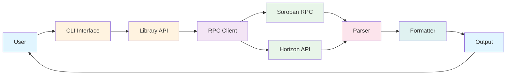

---

## 2. Detailed Component Architecture

Shows internal components and their relationships.

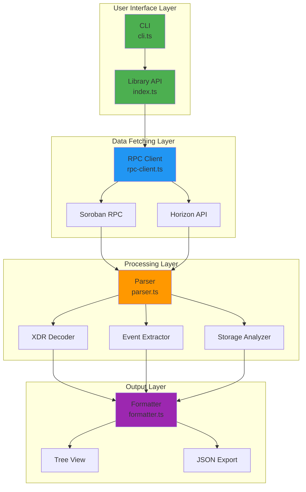

---

## 3. User Flow Diagram

Complete user journey from installation to debugging.

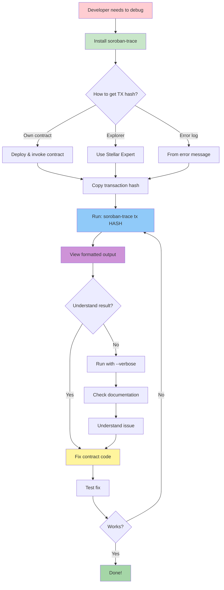

---

## 4. Transaction vs Operation Decision Tree

The crucial concept that soroban-trace clarifies.

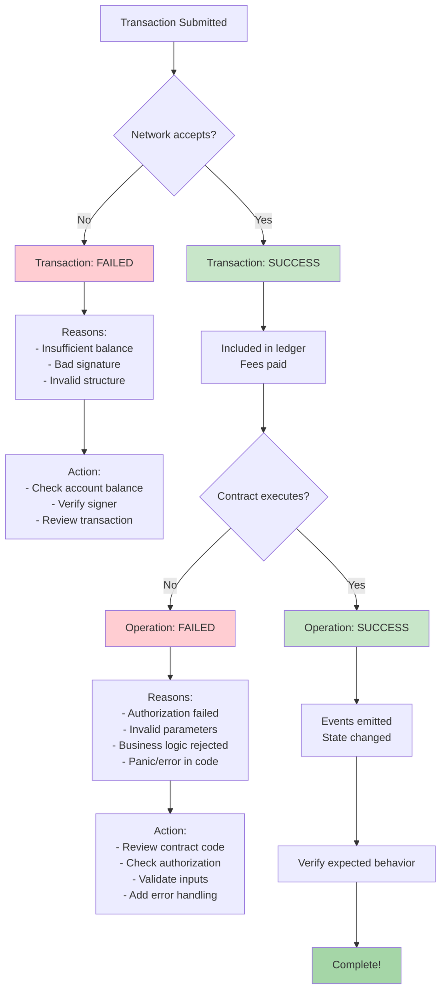

---

## 5. The Four Possible Outcomes

Visual representation of transaction and operation status combinations.

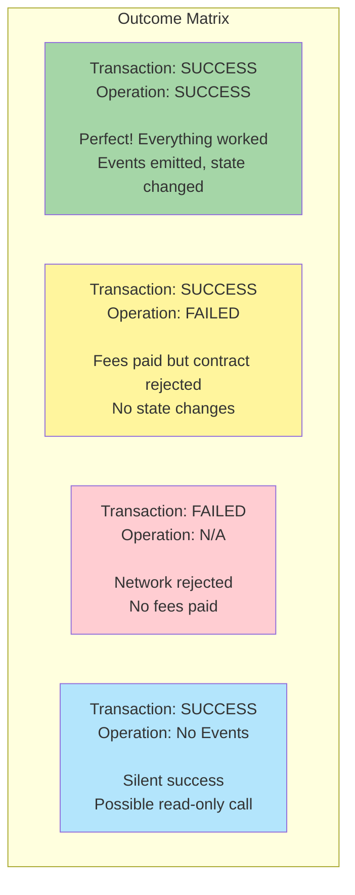

---

## 6. Data Flow Sequence

Shows how data flows through the system.

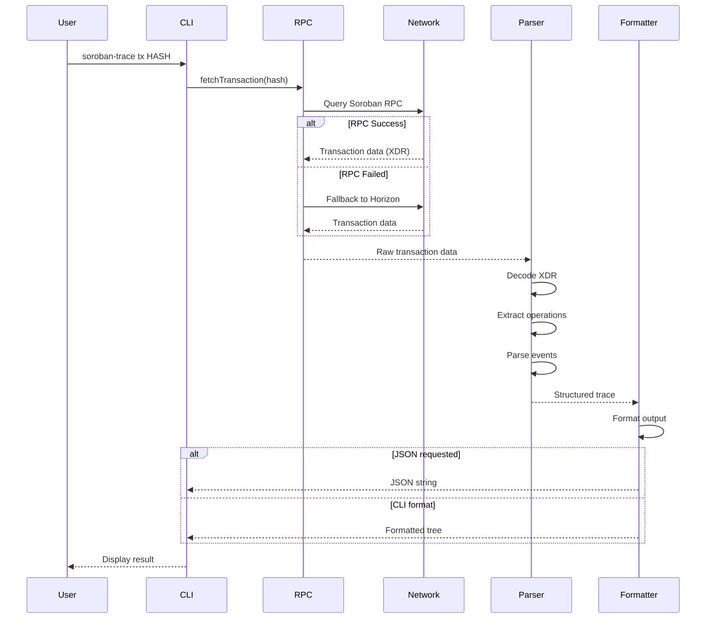

---

## 7. Error Handling Flow

How the tool handles various error scenarios.

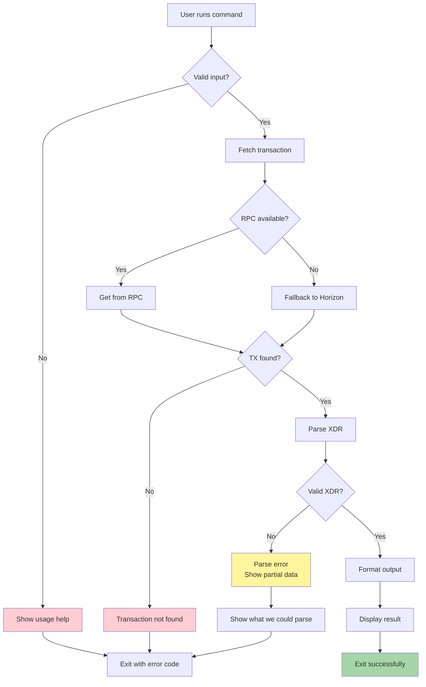

---

## 8. Debugging Workflow

How developers use soroban-trace in their workflow.

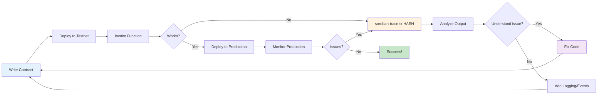

---

## 9. Component Interaction

Detailed view of how components interact.

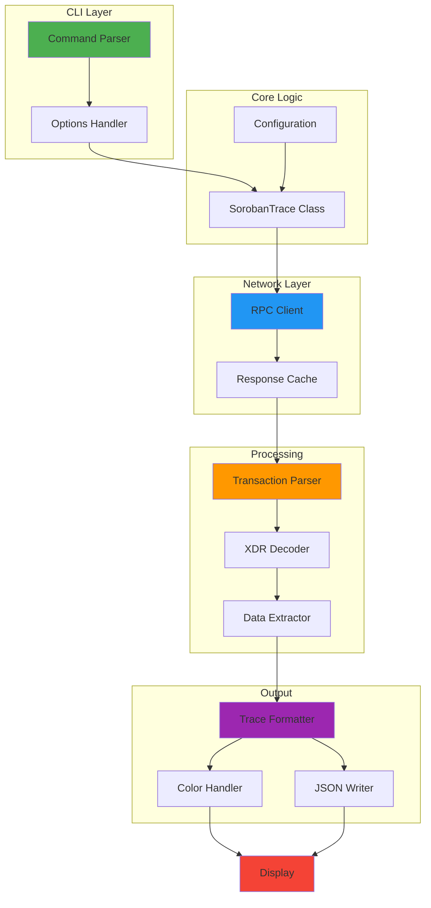

---

## 10. Before vs After Comparison

Visual showing the improvement soroban-trace brings.

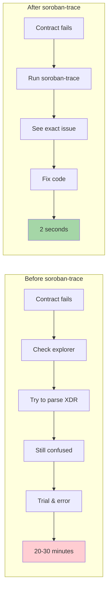

---

## 11. Network Topology

Shows how the tool connects to different networks.

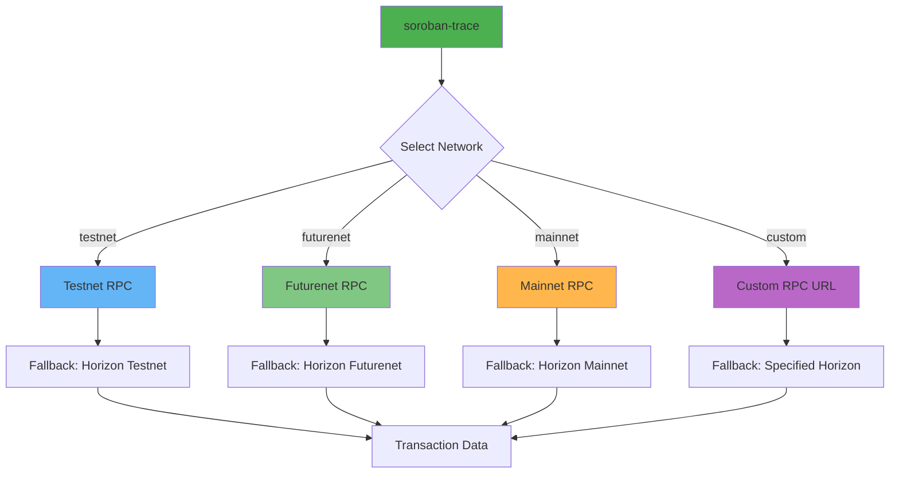

---

## 12. Feature Roadmap

Visual roadmap of current and planned features.

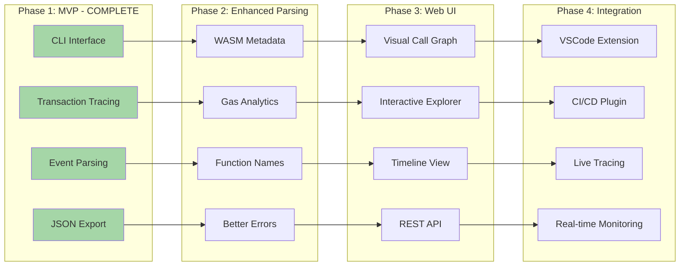

---

## Usage in Documentation

### In GitHub README
```markdown
## Architecture


Or use GitHub's native Mermaid support:
```mermaid
[diagram code]
```
```

### In Notion
1. Add a "Code" block
2. Set language to "Mermaid"
3. Paste the diagram code
4. Notion will render it automatically

### In Documentation Sites
Most modern documentation tools (GitBook, Docusaurus, MkDocs) support Mermaid natively.

---

## Customization

You can customize these diagrams by:
- Changing colors: `style NodeName fill:#hexcolor`
- Adjusting layout: Use `TB` (top-bottom), `LR` (left-right), `RL`, `BT`
- Adding icons: Use emoji in node labels
- Linking nodes: Different arrow types `-->`, `-.->`, `==>`, etc.

---

All diagrams are ready to use in GitHub, Notion, documentation sites, and presentations!

